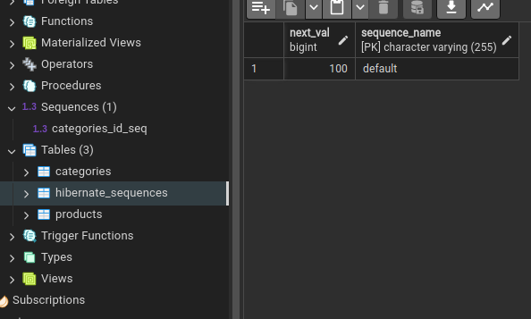
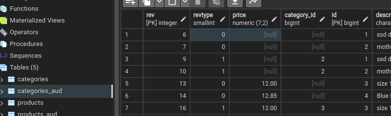
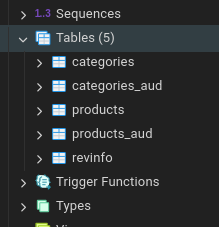
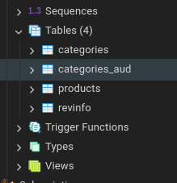

### Before start
if you want test some pair of Entities, you need configure you DB and uncomment the directory of those classes in [hibernate.cfg.xml](src/main/resources/hibernate.cfg.xml), later execute its corresponding test.

last thing, the classes most complete are all about the relation `OneToMany` (Bidirectional, without cascades) also have some basic tests.
# Hibernate Quick Guide

Hibernate is a Java-based framework that simplifies the interaction with databases by providing an object-relational
mapping (ORM) solution. It allows developers to map Java objects to database tables, making database access and
manipulation more convenient and abstracted from low-level SQL queries. This helps in building efficient and
maintainable data-driven applications.

## 1. Dependencies _[Maven](https://mvnrepository.com/)_

### 1.1 Hibernate Core

```xml
<!-- https://mvnrepository.com/artifact/org.hibernate.orm/hibernate-core -->
<dependency>
    <groupId>org.hibernate.orm</groupId>
    <artifactId>hibernate-core</artifactId>
    <version>6.4.1.Final</version>
</dependency>
```

### 1.2 Databases (choose one)

PD: if something fails, try to change from the lastest version to the version installed in your computer.

- PostgreSQL

```xml
<!-- https://mvnrepository.com/artifact/org.postgresql/postgresql -->
<dependency>
    <groupId>org.postgresql</groupId>
    <artifactId>postgresql</artifactId>
    <version>42.7.1</version>
</dependency>
```

- MySQL

```xml
<!-- https://mvnrepository.com/artifact/com.mysql/mysql-connector-j -->
<dependency>
    <groupId>com.mysql</groupId>
    <artifactId>mysql-connector-j</artifactId>
    <version>8.2.0</version>
</dependency> 
```

## 2. Hibernate Configuration

You need to create a file called `hibernate.cfg.xml` in the `src/main/resources` folder.

This file contains the database connection, configuration, Information and the mapping between the Java classes and the
database tables.

**Template**:

```xml
<?xml version='1.0' encoding='utf-8'?>
<!DOCTYPE hibernate-configuration PUBLIC
        "-//Hibernate/Hibernate Configuration DTD//EN"
        "http://www.hibernate.org/dtd/hibernate-configuration-3.0.dtd">
<hibernate-configuration>
    <session-factory>
        <property name="connection.url"/>
        <property name="connection.driver_class"/>
        <!-- <property name="connection.username"/> -->
        <!-- <property name="connection.password"/> -->

        <!-- DB schema will be updated if needed -->
        <!-- <property name="hibernate.hbm2ddl.auto">update</property> -->
    </session-factory>
</hibernate-configuration>
```

 PROPERTY                         | DESCRIPTION                                                                                              
----------------------------------|----------------------------------------------------------------------------------------------------------
 `connection.url`                 | The JDBC URL of the database.                                                                            
 `connection.driver_class`        | The JDBC driver class.                                                                                   
 `connection.username`            | The database username.                                                                                   
 `connection.password`            | The database password.                                                                                   
 `dialect`                        | The SQL dialect of the database.                                                                         
 `hibernate.hbm2ddl.auto`         | Automatically validates or exports schema DDL to the database when the SessionFactory is created.        
 `show_sql`                       | Prints all SQL statements to the console.                                                                
 `format_sql`                     | Pretty print the SQL statements.                                                                         
 `current_session_context_class`  | The context of the current session. Default is `thread`, which is the recommended option, see java docs. 
 `hibernate.hbm2ddl.import_files` | The files to import when the SessionFactory is created. (sql queries)                                    

#### Values

- `connection.url`:
    - MySQL: `jdbc:mysql://localhost:3306/DB_NAME`
    - PostgreSQL: `jdbc:postgresql://localhost:5432/DB_NAME`
    - etc_


- `connection.driver_class`:
    - MySQL: `com.mysql.cj.jdbc.Driver`
    - PostgreSQL: `org.postgresql.Driver`
    - etc


- `dialect`:
    - MySQL: `org.hibernate.dialect.MySQL8Dialect`, or other version (example is using 8).
    - PostgreSQL: `org.hibernate.dialect.PostgreSQLDialect`
    - etc


- `hibernate.hbm2ddl.auto`:
    - `create`: Creates the schema, destroying previous data.
    - `create-drop`: Creates the schema and drops it when the SessionFactory is closed explicitly, typically when the
      application is stopped.
    - `update`: Updates the schema.
    - `validate`: Validates the schema, makes no changes to the database.
    - `none`: Does nothing with the schema, makes no changes to the database.


- `show_sql`:
    - `true`: Prints all SQL statements to the console.
    - `false`: Does not print SQL statements to the console.


- `format_sql`:
    - `true`: Pretty print the SQL statements.
    - `false`: Does not pretty print the SQL statements.


- `current_session_context_class`:
    - `thread`: _The recommended option._ The `Session` is opened when getCurrentSession() is called for the first time
      and closed when the
      transaction ends. if you've got 5 concurrent users, you'll have 5 sessions.
  ```java
   // Example of using thread-based session context in Hibernate
    SessionFactory sessionFactory = // obtain SessionFactory
    
  // In each thread:
    try (Session session = sessionFactory.getCurrentSession()) {
        // No need to explicitly open or close the session
        Transaction transaction = session.beginTransaction();

        // Perform database operations

        transaction.commit();
        // The session is automatically closed
    }
    ```
    - `jta`: Involves external transaction management, such as a Java EE container; The `Session` is bound to and
      unbound from the JTA transaction lifecycle.
    ```java
    // Example using JTA with Hibernate
    UserTransaction tx = // obtain UserTransaction from JNDI or other means

    try {
        tx.begin();

        // Perform multiple database operations within a single transaction

        tx.commit();
    } catch (Exception e) {
        if (tx != null) {
            tx.rollback();
        }
        e.printStackTrace();
    }
    ```
    - `managed`: The `Session` is managed by the container and injected into the application.
    ```java
    // Example using managed session context in native Hibernate API
    try (Session session = sessionFactory.openSession()) {
        // Hibernate takes care of opening and closing the session
        Transaction transaction = session.beginTransaction();

        // Perform database operations

        transaction.commit();
    }  
  // Hibernate automatically closes the session at the end of the try-with-resources block
    ```
    - `org.example.<MyCustomSessionContext.java>`: The `Session` is managed by a custom implementation of
      the `org.hibernate.context.spi.CurrentSessionContext`
      interface, you can implement your own `CurrentSessionContext` and use it with this option.


- `hibernate.hbm2ddl.import_files`:
    - `import.sql`: The default file name for import script.
    - `<filename1>.sql, <filename2>.sql, etc`: Execute the multiple SQL scripts.(in order)

### Access to environment variables

You can access to environment variables in the `hibernate.cfg.xml` file using the `${ENV_VAR}` syntax.
Take care the access to environment variables in linux are a common problem, a related problem happened to me.

## 3. Hibernate SessionFactory

You need to create a class for obtain the `SessionFactory` object.
I'll create `org.example.Util.HibernateUtil.java`

```java

public class HibernateUtil {

    private static StandardServiceRegistry registry;
    private static SessionFactory sessionFactory;

    /**
     * Get the Hibernate SessionFactory
     *
     * @return SessionFactory object
     */
    public static SessionFactory getSessionFactory() {
        if (sessionFactory == null) {
            try {
                // Create registry
                registry = new StandardServiceRegistryBuilder().configure().build();
                // Create MetadataSources
                MetadataSources sources = new MetadataSources(registry);
                // Create Metadata
                Metadata metadata = sources.getMetadataBuilder().build();
                // Create SessionFactory
                sessionFactory = metadata.getSessionFactoryBuilder().build();

            } catch (Exception e) {
                handleException(e);
                closeRegistry();
            }
        }

        return sessionFactory;
    }


    /**
     * Shutdown the SessionFactory
     */
    public static void shutdown() {
        closeRegistry();
    }

    /**
     * Handle the exceptions during the creation of the SessionFactory.
     *
     * @param e exception to handle
     */
    private static void handleException(Exception e) {
        e.printStackTrace();
        // Do something with the Exception
    }

    /**
     * Close the registry
     */
    private static void closeRegistry() {
        if (registry != null) {
            StandardServiceRegistryBuilder.destroy(registry);
        }
    }
}
```

## 4. Hibernate Mapping

### 4.1 Annotations in Entity classes

<br>

```java

@Table(name = "table_name",
        schema = "tienda",
        catalog = "tienda",
        indexes = {
                @Index(name = "weight_id_idx", columnList = "id", unique = true)
        },
        uniqueConstraints = {
                @UniqueConstraint(
                        name = "student_course_unique",
                        columnNames = {"student_id", "course_id"})}
)
public class CourseEnrollmentsEntity {
    @Id
    @GeneratedValue(strategy = GenerationType.IDENTITY)
// or  
//@GeneratedValue(strategy = GenerationType.SEQUENCE, generator = "name_for_reference")
//@SequenceGenerator(name = "name_for_reference", sequenceName = "name_of_sequence_in_db", allocationSize = 100)
    private Long id;

    @Column(length = 100)
    private String name;

    @Column(
            name = "price",
            nullable = false,
            precision = 7,
            scale = 2,
            unique = false,
            updatable = true,
            insertable = true,
            columnDefinition = "varchar(100) not null unique",
            table = "table_name"
    )
    private BigDecimal price;

    @Transient
    private String attribute_not_persistent;
    // ...
}
```

- `@Entity` Annotation marks the class as an entity and how it will name in DB.  
  <br>
    - `@Table` Annotation specifies the table name, schema, catalog, indexes, and unique constraints.
        - `name`: The table name in the database.
        - `schema`: The schema of the table.
        - `catalog`: The catalog of the table.
          > **Catalogs** and **schemas** are "namespaces" that you define on the server side of the database. Some
          databases contains schemas, some contains catalogs, and some contains both. When logging in with a specific
          user, some databases defaults the schema/catalog to the user's namespace, causing the table to not be visible
          to other users, thus, causing the need to use a "common" namespace. So, depending on the database you are
          using to back your data, you might want to ignore those settings. For MySQL, you might want to ignore those
          settings. This is because the "database" part of the JDBC URL (the one after the last slash) points to the
          database name, which is semantically identical to schema (for MySQL). Retrieved
          from: https://itecnote.com/tecnote/mysql-what-are-the-jpa-table-annotation-catalog-and-schema-variables-used-for/
        - `indexes`: The indexes of the table.
        - `uniqueConstraints`: The unique constraints of the table.
            - `name`: The name of the constraint.
            - `columnNames`: The column names of the constraint.
              > e.g. Imagine we have a table that represents the courses enrolled by students. A student can enroll only
              once in a course. (In the table just can have one combination of `student_id` and `course_id`)

                  @UniqueConstraint(
                  name = "student_course_unique",
                  columnNames = {"student_id", "course_id"})}"

- `@Id` Annotation specifies what attribute is the primary key.  
  _make sure that isn't a primitive type(We can use the wrappers), because it can't be null._  
  <br>
  - `@GeneratedValue` Annotation specifies how the primary key will be generated, we've got 5 options: `AUTO`, `IDENTITY`, `SEQUENCE`, `TABLE`, `UUID`: 
      
1. `AUTO` (default): Hibernate will choose the generation strategy based on the database capabilities.

SQL generated by Hibernate:
```SQL
-- Table: tienda.products

-- DROP TABLE IF EXISTS tienda.products;

CREATE TABLE IF NOT EXISTS tienda.products
(
    price numeric(7,2),
    category_id bigint,
    id bigint NOT NULL,
    description character varying(100) COLLATE pg_catalog."default",
    name character varying(100) COLLATE pg_catalog."default" NOT NULL,
    CONSTRAINT products_pkey PRIMARY KEY (id),
    CONSTRAINT products_name_key UNIQUE (name),
    CONSTRAINT fkog2rp4qthbtt2lfyhfo32lsw9 FOREIGN KEY (category_id)
    REFERENCES tienda.categories (id) MATCH SIMPLE
    ON UPDATE NO ACTION
    ON DELETE NO ACTION
    )

    TABLESPACE pg_default;

ALTER TABLE IF EXISTS tienda.products
    OWNER to cristian;


-- SEQUENCE: tienda.products_seq

-- DROP SEQUENCE IF EXISTS tienda.products_seq;
CREATE SEQUENCE IF NOT EXISTS tienda.products_seq
    INCREMENT 50
    START 1
    MINVALUE 1
    MAXVALUE 9223372036854775807
    CACHE 1;

ALTER SEQUENCE tienda.products_seq
    OWNER TO cristian;
```
2. `IDENTITY`:
  - **Pros**: Simple, easy to use, and generally efficient.
  - **Cons**: The primary drawback is that the exact mechanism for generating IDs is database-dependent, and it
  might not be as efficient in scenarios where a large number of records are being inserted simultaneously.   

Code generated using `IDENTITY`:
```postgresql
-- POSTGRESQL --
    
-- Table: tienda.products

-- DROP TABLE IF EXISTS tienda.products;

CREATE TABLE IF NOT EXISTS tienda.products
(
price numeric(7,2),
category_id bigint,
id bigint NOT NULL DEFAULT nextval('tienda.products_id_seq'::regclass),
description character varying(100) COLLATE pg_catalog."default",
name character varying(100) COLLATE pg_catalog."default" NOT NULL,
CONSTRAINT products_pkey PRIMARY KEY (id),
CONSTRAINT products_name_key UNIQUE (name),
CONSTRAINT fkog2rp4qthbtt2lfyhfo32lsw9 FOREIGN KEY (category_id)
REFERENCES tienda.categories (id) MATCH SIMPLE
ON UPDATE NO ACTION
ON DELETE NO ACTION
)

TABLESPACE pg_default;

ALTER TABLE IF EXISTS tienda.products
OWNER to cristian;

-- SEQUENCE: tienda.products_id_seq

-- DROP SEQUENCE IF EXISTS tienda.products_id_seq;

CREATE SEQUENCE IF NOT EXISTS tienda.products_id_seq
INCREMENT 1
START 1
MINVALUE 1
MAXVALUE 9223372036854775807
CACHE 1
OWNED BY products.id;

ALTER SEQUENCE tienda.products_id_seq
OWNER TO cristian;
```
3.`SEQUENCE`: for massive inserts.  
        - **Pros**: Provides more control over the generation process. It's especially useful in situations where you
      want to pre-allocate a block of IDs for better performance.
        - **Cons**: Requires a separate database sequence, and the allocation size should be carefully tuned based on
      the expected usage patterns.

  **Why `SEQUENCE` might be faster:**
    - **Pre-allocation** (`allocationSize`): When using `SEQUENCE` with an `allocationSize` greater than 1, Hibernate
      can pre-allocate a block of IDs from the sequence. This reduces the number of times it needs to interact with the
      database to obtain a new ID, which can improve performance.
    - **Reduced contention**: In high-concurrency scenarios, where multiple transactions are inserting records
      simultaneously, using a sequence might reduce contention compared to auto-increment columns. Each transaction can
      work with its pre-allocated block of IDs without waiting for the database to generate them.  
      <br>
```java
@Id
@GeneratedValue(strategy = GenerationType.SEQUENCE, generator = "name_for_reference")
@SequenceGenerator(name = "name_for_reference", sequenceName = "name_of_sequence_in_db", allocationSize = 100)
private java.lang.Long id;
```  
SQL generated by Hibernate:
```sql
-- Table: tienda.products

-- DROP TABLE IF EXISTS tienda.products;

CREATE TABLE IF NOT EXISTS tienda.products
(
    price numeric(7,2),
    category_id bigint,
    id bigint NOT NULL,
    description character varying(100) COLLATE pg_catalog."default",
    name character varying(100) COLLATE pg_catalog."default" NOT NULL,
    CONSTRAINT products_pkey PRIMARY KEY (id),
    CONSTRAINT products_name_key UNIQUE (name),
    CONSTRAINT fkog2rp4qthbtt2lfyhfo32lsw9 FOREIGN KEY (category_id)
    REFERENCES tienda.categories (id) MATCH SIMPLE
    ON UPDATE NO ACTION
    ON DELETE NO ACTION
    )

    TABLESPACE pg_default;

ALTER TABLE IF EXISTS tienda.products
    OWNER to cristian;

-- SEQUENCE: tienda.name_of_sequence_in_db

-- DROP SEQUENCE IF EXISTS tienda.name_of_sequence_in_db;

CREATE SEQUENCE IF NOT EXISTS tienda.name_of_sequence_in_db
    INCREMENT 100
    START 1
    MINVALUE 1
    MAXVALUE 9223372036854775807
    CACHE 1;

ALTER SEQUENCE tienda.name_of_sequence_in_db
    OWNER TO cristian;
```


4. `TABLE` (not recommended):  
        - **Pros**: It's portable across different databases.  
        - **Cons**: It's the least efficient strategy, as it requires an additional round-trip to the database to
      obtain the next ID. It's also prone to concurrency issues, as multiple transactions might try to insert records
      with the same ID.  

SQL generated by Hibernate:
```sql
-- Table: tienda.hibernate_sequences

-- DROP TABLE IF EXISTS tienda.hibernate_sequences;

CREATE TABLE IF NOT EXISTS tienda.hibernate_sequences
(
    next_val bigint,
    sequence_name character varying(255) COLLATE pg_catalog."default" NOT NULL,
    CONSTRAINT hibernate_sequences_pkey PRIMARY KEY (sequence_name)
)

TABLESPACE pg_default;

ALTER TABLE IF EXISTS tienda.hibernate_sequences
    OWNER to cristian;
```



---------------------------------------


- `@Column` Specifies column properties.
    - `length`: The column length. (only for String)
    - `name`: The column name.
    - `nullable`: Whether the column is nullable.
    - `precision`: The precision for a decimal (exact numeric) column.
    - `scale`: The scale for a decimal (exact numeric) column.
    - `unique`: Whether the column is a unique key.
    - `updatable`: Whether the column is included in SQL UPDATE statements generated by the persistence provider.
    - `insertable`: Whether the column is included in SQL INSERT statements generated by the persistence provider.
    - `columnDefinition`: The SQL fragment that is used when generating the DDL for the column.
    - `table`: The name of the table that contains the column.
      If we use `precision=7` and `scale=2`, the column will be `DECIMAL(7,2)`, in others words, the column will have 7
      digits in total, 2 of them will be decimals(after the dot).  
      <br>

- `@Transient` Annotation marks the attribute as not persistent.
  <br>

#### PD: static attributes

Hibernate don't persist `static` attributes  
<br>

### 4.1.1 One TO One

- `@OneToOne` & `@JoinColumn`  
  This is the most recommended way to map the associations.  
  `@JoinColumn` (Optional) The name of the foreign key column. The table in which it is found depends upon the context.

```java

@OneToOne
@JoinColumn(name = "address_id")
private AddressEntity address;
```

- `@OneToOne` &  `@PrimaryKeyJoinColumn`  
  `@PrimaryKeyJoinColumn` (Optional) The primary key column of the current table that is used as a foreign key to the
  primary key of another table.

```java

@OneToOne
@PrimaryKeyJoinColumn
private AddressEntity address;
```

- `@OneToOne` & `@JoinTable`  
  `@JoinTable` (Optional) The join table that holds the foreign key column(s) of the current table that references the
  primary key of the other table.

```java

@OneToOne
@JoinTable(name = "address",
        joinColumns = @JoinColumn(name = "address_id"),
        inverseJoinColumns = @JoinColumn(name = "id"))
private AddressEntity address;
```

- `@OneToOne` & `@MapsId`  
  `@MapsId` (Optional) The attribute within the composite key to which the relationship attribute corresponds.

```java

@Entity
class Customer {
    @EmbeddedId
    CustomerId id;
    boolean preferredCustomer;

    @MapsId("userId")
    @JoinColumns({
            @JoinColumn(name = "userfirstname_fk", referencedColumnName = "firstName"),
            @JoinColumn(name = "userlastname_fk", referencedColumnName = "lastName")
    })
    @OneToOne
    User user;
}

@Embeddable
class CustomerId implements Serializable {
    UserId userId;
    String customerNumber;
}

@Entity
class User {
    @EmbeddedId
    UserId id;
    Integer age;
}

@Embeddable
class UserId implements Serializable {
    String firstName;
    String lastName;
}
```

_https://docs.jboss.org/hibernate/annotations/3.5/reference/en/html_single/#entity-mapping-identifier_

- Etc...

### 4.1.1 One To Many (Unidirectional)

```java

@ManyToOne(
        //cascade = {CascadeType.PERSIST, CascadeType.MERGE},
        fetch = FetchType.LAZY,
        targetEntity = CategoryEntity.class,
        optional = true)
@JoinColumn(name = "category_id")
private CategoryEntity category;
```

in the other side of the relationship has only logic of Entities, nothing about the relationship

### 4.1.1 OneToMany (Without cascades and Bidirectional)

```java
// in product entity (Many)
//=================== One to many ||| bidirectional ===================\\
// - Many is the owner of the relationship (have the @JoinColumn), Relationship is inverse
// - Must add "MANY" entity explicitly in the "ONE" entity, when "ONE" is set (this can also be done in the "ONE")
@ManyToOne(/*cascade = {CascadeType.ALL},*/
        fetch = FetchType.EAGER,
        targetEntity = CategoryEntity.class,
        optional = true)
@JoinColumn(name = "category_id")
private CategoryEntity category;

public void setCategory(CategoryEntity category) {
    this.category = category;
    category.getProducts().add(this);
}
```

- `optional`: Defines whether the association is optional. If set to false then a non-null relationship must always
  exist.  
  `@JoinColumn` (Optional) The name of the foreign key column. The table in which it is found depends upon the context.

See more below...

```java
// in category (One)
@OneToMany(/*cascade = {CascadeType.ALL}*/,
        fetch = FetchType.LAZY,
        mappedBy = "category",
        orphanRemoval = true,
        targetEntity = ProductEntity.class)
private List<ProductEntity> products = new ArrayList<>();
```

Later you need cand do:  
_PD: `category1` and `product1` must be persisted in the database before do the below_

1. `product1.setCategory(category1)`
2. `productDAO.merge(product1)` //in the product1 we merged because it has the field that represent the
   relationship `category_id`
   <br>

----------------------------------------------------------------

#### You can also do inverse (Not recommended)

In "One" side:

```java
   //=================== One to many ||| bidirectional ===================\\
// - Must set the "One" entity explicitly in the "Many" entity, when it is added.(If we don't do this here we must do it in the "Many" entity)

@OneToMany(cascade = {CascadeType.ALL}, fetch = FetchType.LAZY, mappedBy = "category", orphanRemoval = true, targetEntity = ProductEntity.class)
private List<ProductEntity> products = new ArrayList<>();

public void addProducts(ProductEntity... products) {
    this.products.addAll(Arrays.asList(products));
    //"One" is set in the "Many" entity
    Arrays.asList(products).forEach(product -> product.setCategory(this));
}
//============================================================================\\
```

In "Many" side:

```java
  //=================== One to many ||| bidirectional ===================\\
// - Many is the owner of the relationship (have the @JoinColumn), Relationship is inverse
@ManyToOne(/*cascade = {CascadeType.ALL},*/ fetch = FetchType.EAGER, targetEntity = CategoryEntity.class, optional = true)
@JoinColumn(name = "category_id")
private CategoryEntity category;
```

Later you need cand do:  
_PD: `category1` and `product1` must be persisted in the database before do the below_

1. `category1.addProducts(product1)`
2. `category1.forEach(product -> productDAO.merge(product))`
   <br>

----------------------------------------------------------------

### 4.1.1 ManyToMany

We should put the notation `@ManyToMany` in the own of the relationship, for example if we've got 2 entities:
`UserEntity` and `RoleEntity`, we should put the notation `@ManyToMany` in the `UserEntity`.

```java

@ManyToMany(
        fetch = FetchType.EAGER,
        targetEntity = RoleEntity.class,
        cascade = CascadeType.PERSIST)

@JoinTable(
        name = "users_roles",
        joinColumns = @JoinColumn(name = "user_id"),
        inverseJoinColumns = @JoinColumn(name = "role_id"))

private Set<RoleEntity> roles;
```

**Unidirectional:** In the other side of the relationship isn't necessary set any logic about the relationship, only
should have the logic of an Hibernate Entity

**Bidirectional:** We should set only the notation `@OneToMany` with `mappedBy="<attribute_name_in_other_side>"` below
the Collection of the relationship

```java

@ManyToMany(
        mappedBy = "roles"
        //.......
)
private Set<UserEntity> users;
```

----------------------------------------------------------------

- `cascade`: Specifies the operations that must be cascaded to the target of the association.
- `fetch`: Specifies whether the association should be lazily loaded or must be eagerly fetched.
- `mappedBy`: The field that owns the relationship. Required unless the relationship is unidirectional.
- `orphanRemoval` with true, if an secondary Entity is removed from the collection of the principal Entity("ONE"), it
  will be removed
  from the database.(with `CascadeType.REMOVE` deletes the associated entities when the principal is deleted)
- `targetEntity`: The entity class that is the target of the association. Optional only if the collection property is
  defined using Java generics. Must be specified otherwise.

 CascadeType | Description                                                                         
-------------|-------------------------------------------------------------------------------------
 `ALL`       | Apply all operations (persist, remove, refresh, merge, detach) to the child entity. 
 `DETACH`    | Detach the child entity when the parent entity is detached.                         
 `MERGE`     | Merge the child entity when the parent entity is merged.                            
 `PERSIST`   | Persist the child entity when the parent entity is persisted.                       
 `REFRESH`   | Refresh the child entity when the parent entity is refreshed.                       
 `REMOVE`    | Remove the child entity when the parent entity is removed.                          

e.g. `session.persist(category)`  
e.g. `session.remove(category)`

> Hibernate Methods (`save`, `update`, `delete`, etc.): In this Hibernate operations, the Cascade configured will be
> apply automatically (`CASCADE.ALL`) in the relationships.  
`Criteria API`, `Native Queries`, `MutationQuerys`, etc.: In these cases, the `CASCADE` don't apply automatically. When
> we execute **NativeQuerys**, **CriteriaQuerys**(CriteriaBuilder), **MutationQuerys**, or other that aren't be the
> Hibernate methods, we need manage the cascade manually.

<br>

- `session.persist(<@Entity>)` persists an instance, the entity in the argument must not have an ID, then automatically
  sets an ID if successfully persisted, also starts to be an attached hibernate Object(Entity))

**Docs:** Make a transient instance persistent and mark it for later insertion in the database. This operation cascades
to associated instances if the association is mapped with jakarta.persistence.CascadeType.PERSIST.
For an entity with a generated id, persist() ultimately results in generation of an identifier for the given instance.
But this may happen asynchronously, when the session is flushed, depending on the identifier generation strategy.  
Overrides: _`persist` in interface `EntityManager`_
Params: `object` – a transient instance to be made persistent

<br>

- `session.merge(<@Entity>)` Copy all attributes(Fields in DB) to the row in DB that have its ID, the Entity in the
  argument isn't necessary be an attached Object(Entity)

**Docs:**
Copy the state of the given object onto the persistent object with the same identifier. If there is no persistent
instance currently associated with the session, it will be loaded. Return the persistent instance. If the given instance
is unsaved, save a copy and return it as a newly persistent instance. The given instance does not become associated with
the session. This operation cascades to associated instances if the association is mapped with
jakarta.persistence.CascadeType.MERGE.

Overrides: _`merge` in interface `EntityManager`_  
Params: _`object` – a detached instance with state to be copied_
Returns: _an updated persistent instance_

<br>

-`session.remove`  
**Docs:** Mark a persistence instance associated with this session for removal from the underlying database. Ths
operation cascades to associated instances if the association is mapped `jakarta.persistence.CascadeType.REMOVE`.

**PD:** the `Cascade.REMOVE` doesn't have effect in:

```java
session2.createMutationQuery("DELETE FROM UserEntity u WHERE u.id = :id")
        .

setParameter("id",user2.getId())
        .

executeUpdate(); //cascade.all only affect in session.remove
session2.

getTransaction().

commit();
```

<br>

-`session.refresh`

1. **Object Retrieval:** You first pass an existing persistent entity object (e.g., userEntity) to the refresh() method.
2. **Database Synchronization:** Hibernate initiates a communication with the database to retrieve the latest values for
   all fields of that entity.
3. **Attribute Overwrite:** The values currently held within the object's attributes are discarded and replaced with the
   fresh values fetched from the database.
4. **Unsaved Changes Discarded:** Any modifications made to the entity within the current Hibernate session, but not yet
   committed to the database, are lost.
5. **Identity Preservation:** The object's identity, represented by its primary key, remains intact, ensuring it's still
   associated with the same database row.

**Docs:**
Reread the state of the given managed instance associated with this session from the underlying database. This may be
useful:

- when a database trigger alters the object state upon insert or update,
- after executing any HQL update or delete statement,
- after executing a native SQL statement, or
- after inserting a java.sql.Blob or java.sql.Clob.

This operation cascades to associated instances if the association is mapped
with `jakarta.persistence.CascadeType.REFRESH`.  
This operation requests LockMode.READ. To obtain a stronger lock, call refresh(Object, LockMode).  
**Overrides:** -`refresh` in interface `EntityManager`_  
**Params:** `object` – a persistent or detached instance

<br>

- `session.detach(<@Entity>)`

**Docs:**
Remove this instance from the session cache. Changes to the instance will not be synchronized with the database. This
operation cascades to associated instances if the association is mapped with `jakarta.persistence.CascadeType.DETACH`.  
**Overrides:** _`detach` in interface `EntityManager`_  
**Params:** _`object` – the managed instance to detach_

//DAOs

## 5. Example of DAOs:

```java
Session session = HibernateUtil.getSessionFactory().openSession()
``` 

Relation: OneToMany (Bidirectional, without cascades)

**Entities:**

- [CategoryEntity](src/main/java/org/example/Entities/OneToManyToOne_Bidirectional/CategoryEntity.java)
- [ProductEntity](src/main/java/org/example/Entities/OneToManyToOne_Bidirectional/ProductEntity.java)

### Hibernate Methods

- [CategoryDAOImp](src/main/java/org/example/DAOs/OneToManyToOne_Bidirectional/Category/CategoryDAOImpl.java)
- [CategoryDAOImplTest](src/test/java/org/example/DAOs/OneToMany_Bidirectional/CategoryDAOTest.java)

### Criteria Builder

- [CategoryDAOCriteria](src/main/java/org/example/DAOs/OneToManyToOne_Bidirectional/Category/CategoryDAOCriteria.java)
- [CategoryDAOCriteriaTest](src/test/java/org/example/DAOs/OneToMany_Bidirectional/CriteriaCategoryDAOTest.java)

### Native Queries

- [CategoryDAOCriteria](src/main/java/org/example/DAOs/OneToManyToOne_Bidirectional/Category/CategoryDAONative.java)
- [CategoryDAONativeTest](src/test/java/org/example/DAOs/OneToMany_Bidirectional/NativeCategoryDAOTest.java)

----------------------------------------------------------------

## Named Queries
You can create a named query in the `@Entity` class, and use it in the DAOs.
```java
@Entity
@Table(name = "products")
@NamedQuery(name = "ProductEntity.find10Cheapest", query = "SELECT p FROM ProductEntity p ORDER BY p.price ASC LIMIT 10")
public class ProductEntity {
    //...
```
In the DAOs:
```java
List<ProductEntity> products;

products = session
        .createNamedQuery("ProductEntity.find10Cheapest", ProductEntity.class)
        .list();
```

## 6. Events and Interceptors

### 6.1 Events

In the `@Entity` class we can add the following methods:
> When we set this **Lifecycle callbacks** in the `@Entity` class, we are violating
> the `Single Responsibility Principle`, because the `@Entity` class is only for represent the table in the database,
> not
> for manage the events.

```java

@PrePersist
public void prePersist() {
    // this method is called before the entity is persisted in the database
}

@PostPersist
public void postPersist() {
    // this method is called after the entity is persisted in the database
}

@PreUpdate
public void preUpdate() {
    // this method is called before the entity is updated in the database
}

@PostUpdate
public void postUpdate() {
    // this method is called when the entity is updated in the database
}

@PreRemove
public void preRemove() {
    // this method is called before the entity is removed from the database
}

@PostRemove
public void postRemove() {
    // this method is called when the entity is removed from the database
}

@PostLoad
public void postLoad() {
    // this method is called when the entity is loaded from the database in persistence context
}
```

- `@PostLoad`:
  When `@PostLoad` is Triggered:

1. Fetching an Entity: `EntityManager.find(Book.class, 1L):`

   Hibernate retrieves the Book entity with ID 1 from the database and places it in the persistence context. It then
   calls the @PostLoad method on the loaded entity.  
   <br>

2. Executing a Query: `Query query = em.createQuery("SELECT b FROM Book b");`:  
   Hibernate fetches multiple Book entities from the database and puts them in the persistence context. The @PostLoad
   method is called for each loaded entity.  
   <br>

3. Refreshing an Entity: `em.refresh(book)`:  
   This forces Hibernate to reload the entity from the database and overwrite any changes made in the persistence
   context. The @PostLoad method is called again on the refreshed entity.

### 6.2 Interceptors

We can create a class that implements the `org.hibernate.Interceptor` interface, and override the methods that we want
to intercept.

Performs the same function as an event listener, in this way we don't violate the `Single Responsibility Principle`.

1. Implement the `org.hibernate.Interceptor` interface.
2. Override the methods that we want to intercept.
3. Register the interceptor in the `HibernateUtil`

Each method execute just before execute the SQL query, for example if we
do: `session.persist(<category_with_name_null>)` and in the method `persist` throw an exception, the SQL query won't be
executed and the Interceptor `onSave` won't be executed.

- **1 & 2:** Implements and Override the methods that we want to intercept:

```java
package org.example.Entities.OneToManyToOne_Bidirectional;

import org.hibernate.CallbackException;
import org.hibernate.Interceptor;
import org.hibernate.type.Type;

public class CategoryInterceptor implements Interceptor {
    /**
     * Called before an object is saved. The interceptor may modify the {@code state}, which will be used for
     * the SQL {@code INSERT} and propagated to the persistent object.
     *
     * @param entity        The entity instance whose state is being inserted
     * @param id            The identifier of the entity
     * @param state         The state of the entity which will be inserted
     * @param propertyNames The names of the entity properties.
     * @param types         The types of the entity properties
     * @return {@code true} if the user modified the {@code state} in any way.
     * @throws CallbackException Thrown if the interceptor encounters any problems handling the callback.
     */
    @Override
    public boolean onSave(Object entity, Object id, Object[] state, String[] propertyNames, Type[] types) throws CallbackException {
        if (entity instanceof CategoryEntity) {
            CategoryEntity category = (CategoryEntity) entity;
            System.out.println(category.toString() + "\n\n\n\n\n\n\n\n\n\n\n\n\n\n\n\n\n");
        }

        return Interceptor.super.onSave(entity, id, state, propertyNames, types);
    }

    /**
     * Called before an object is deleted. It is not recommended that the interceptor modify the {@code state}.
     *
     * @param entity        The entity instance being deleted
     * @param id            The identifier of the entity
     * @param state         The state of the entity
     * @param propertyNames The names of the entity properties.
     * @param types         The types of the entity properties
     * @throws CallbackException Thrown if the interceptor encounters any problems handling the callback.
     */
    @Override
    public void onDelete(Object entity, Object id, Object[] state, String[] propertyNames, Type[] types) throws CallbackException {
        if (entity instanceof CategoryEntity) {
            CategoryEntity category = (CategoryEntity) entity;
            System.out.println(category.toString() + "\n\n\n\n\n\n\n\n\n\n\n\n\n\n\n\n\n");
        }

        Interceptor.super.onDelete(entity, id, state, propertyNames, types);
    }

    //................
}
```

3. Register the interceptor in the `HibernateUtil`

```java

public class HibernateUtil {
    private static StandardServiceRegistry registry;
    private static SessionFactory sessionFactory;

    /**
     * Get the Hibernate SessionFactory
     *
     * @return SessionFactory object
     */
    public static SessionFactory getSessionFactory() {
        if (sessionFactory == null) {
            try {
                // Create registry
                registry = new StandardServiceRegistryBuilder().configure().build();
                // Create MetadataSources
                MetadataSources sources = new MetadataSources(registry);
                // Create Metadata
                Metadata metadata = sources.getMetadataBuilder().build();
                // Create SessionFactory
                sessionFactory = metadata.getSessionFactoryBuilder()
// ------------------- HERE WE REGISTER THE INTERCEPTOR -------------------\\
                        .applyInterceptor(new CategoryInterceptor())
                        .build();

            } catch (Exception e) {
                handleException(e);
                closeRegistry();
            }
        }

        return sessionFactory;
    }


    /**
     * Shutdown the SessionFactory
     */
    public static void shutdown() {
        closeRegistry();
    }

    /**
     * Handle the exceptions during the creation of the SessionFactory.
     *
     * @param e exception to handle
     */
    private static void handleException(Exception e) {
        e.printStackTrace();
        // Do something with the Exception
    }

    /**
     * Close the registry
     */
    private static void closeRegistry() {
        if (registry != null) {
            StandardServiceRegistryBuilder.destroy(registry);
        }
    }
}
```

## 7. Auditing of Entities

Registry all the changes in the entities, if we want to know who and when change a whole entity or only his attributes(
fields in DB).

### 7.1 Maven Dependencies

https://mvnrepository.com/artifact/org.hibernate.orm/hibernate-envers

```xml
<!-- https://mvnrepository.com/artifact/org.hibernate.orm/hibernate-envers -->
<dependency>
    <groupId>org.hibernate.orm</groupId>
    <artifactId>hibernate-envers</artifactId>
    <version>6.4.1.Final</version>
</dependency>
```

[Docs](https://docs.jboss.org/hibernate/orm/current/userguide/html_single/Hibernate_User_Guide.html#envers)

### 7.2 Auditing

> Is recommended audit entities outside of own production DB(in External servers), because it can generate a lot of
> data, and the performance can be affected. Hibernate Envers can be configured for do it.

We need to add the `@Audited` annotation in the entity that we want to audit.  
if the entity has a relationship with another entity class, we need to add the `@Audited` annotation in the other entity
class too or else
throw `org.hibernate.envers.boot.EnversMappingException: An audited relation from org.example.Entities.OneToManyToOne_Bidirectional.CategoryEntity.products to a not audited entity org.example.Entities.OneToManyToOne_Bidirectional.ProductEntity!  : origin(envers)`

When we audit an entity, in the audit table will be created a column named `REV` that represents the revision number,
and a column named `REVTYPE` that represents the type of the revision.


| `REVTYPE` |        |  
|-----------|--------|
| `0`       | insert |
| `1`       | update |
| `2`       | delete |

see [docs.....](https://docs.jboss.org/hibernate/orm/current/userguide/html_single/Hibernate_User_Guide.html#envers)

1. Audit the whole entity and its relationships  
   (put the `@Audited` annotation in the entity and in the other side of the relationship also you do it)

```java

@Entity
@Table(name = "categories")
@Audited // see it
public class CategoryEntity {
    //...
    @OneToMany(/*cascade = {CascadeType.ALL},*/fetch = FetchType.LAZY, mappedBy = "category", orphanRemoval = true, targetEntity = ProductEntity.class)
    private List<ProductEntity> products = new ArrayList<>();
    //...
}
```

```java

@Entity
@Table(name = "products")
@Audited //see it
public class ProductEntity {
    //...
    @ManyToOne(/*cascade = {CascadeType.ALL},*/ fetch = FetchType.EAGER, targetEntity = CategoryEntity.class, optional = true)
    @JoinColumn(name = "category_id")
    private CategoryEntity category;
    //...
}
```



2. Audit only the entity not the relationships  
   (put the `@Audited` annotation in the entity, and the Attribute of relationship put the `@NotAudited` annotation)

```java
import org.hibernate.envers.NotAudited;

@Entity
@Table(name = "categories")
@Audited // see it
public class CategoryEntity {
    //...
    @NotAudited
    @OneToMany(/*cascade = {CascadeType.ALL},*/fetch = FetchType.LAZY, mappedBy = "category", orphanRemoval = true, targetEntity = ProductEntity.class)
    private List<ProductEntity> products = new ArrayList<>();
    //...
}
```



3. Only Audit some Attributes of the entity  
   (put the `@Audited` annotation in the Entity Attribute that we want to audit)

```java

@Entity
@Table(name = "categories")
public class CategoryEntity {
    //...
    @Audited
    @Column(length = 100, nullable = false, unique = true)
    private String name;
//...
```

-----------------
All the properties into the notation `@Audited()` are optional...

- `targetAuditMode` means the audit mode for the attribute.
    - `RelationTargetAuditMode.AUDITED`: The related entities will be audited.
    - `RelationTargetAuditMode.NOT_AUDITED`: The related entities will not be audited.
    - `RelationTargetAuditMode.IGNORE`: The related entities will be ignored.
- `modifiedColumnName` the name of the column (similar to `@Column(name="")` annotation
- `withModifiedFlag` if true, a boolean column will be added to the audit table to indicate if the value of the
  attribute has been modified or not.
- `targetNotFoundAction` the action to take when the target entity is not found.
    - `RelationTargetAuditMode.NOT_AUDITED`: The related entities will not be audited.
    - `RelationTargetAuditMode.IGNORE`: The related entities will be ignored.
    - `RelationTargetAuditMode.EXCEPTION`: An exception will be thrown.

**PD**: Some of these properties are only available in the `@Audited` annotation of the attribute of the entity, others
are only available in the `@Audited` annotation of the entity class.

